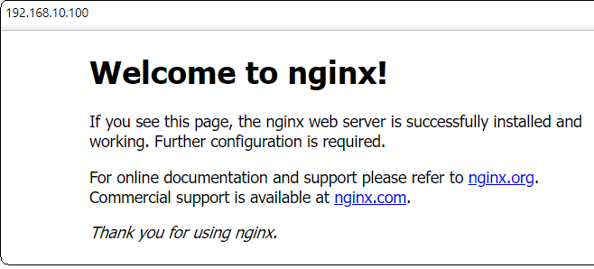

# sync and provisioning task
- configure the vagrantfile to run the provisioning script at the boot-time (at the time of vagrant up)

## create an 'app' folder and create script.sh to include provisioning steps
```script.sh
#!/bin/bash
sudo apt-get update -y
sudo apt-get upgrade -y
sudo apt-get install nginx -y
sudo systemctl status nginx
```
## create a Vagrantfile to include sync app folder and provision to run shell script in VM
```Vagrantfile
Vagrant.configure("2") do |config|
 
# creating a virtual machine ubuntu
 config.vm.box = "ubuntu/xenial64"

# assign private ip to our VM
 config.vm.network "private_network", ip: "192.168.10.100"

# ensure to install hostupdater plugin in our local host before rerunning the vagrant
 config.hostsupdater.aliases = ["development.local"]

# Sync folder from OS to VM
               # "." means current location -  into/inside VM
 config.vm.synced_folder ".", "/home/vagrant/app"          

# running provisioning script with just 'vagrant up' without ssh into VM
 config.vm.provision "shell", path: "./app/script.sh"

end
```
- with vagrant up - it should create the VM - run the script.sh available on our localhost to provision update - upgrade and nginx.
### run 'vagrant up'
```
    $ vagrant up
Bringing machine 'default' up with 'virtualbox' provider...
==> default: Importing base box 'ubuntu/xenial64'...
==> default: Matching MAC address for NAT networking...
==> default: Checking if box 'ubuntu/xenial64' version '20210623.0.0' is up to date...
==> default: Setting the name of the VM: sync_and_provisioning_task_default_1636401512689_87406
==> default: Fixed port collision for 22 => 2222. Now on port 2200.
==> default: Clearing any previously set network interfaces...
==> default: Preparing network interfaces based on configuration...
    default: Adapter 1: nat     
    default: Adapter 2: hostonly
==> default: Forwarding ports...
    default: 22 (guest) => 2200 (host) (adapter 1)
==> default: Running 'pre-boot' VM customizations...
==> default: Booting VM...
==> default: Waiting for machine to boot. This may take a few minutes...
    default: SSH address: 127.0.0.1:2200
    default: SSH username: vagrant
    default: SSH auth method: private key
    default: 
    default: Vagrant insecure key detected. Vagrant will automatically replace
    default: this with a newly generated keypair for better security.
    default: 
    default: Inserting generated public key within guest...
    default: Removing insecure key from the guest if it's present...
    default: Key inserted! Disconnecting and reconnecting using new SSH key...
==> default: Machine booted and ready!
==> default: Checking for guest additions in VM...
    default: The guest additions on this VM do not match the installed version of
    default: VirtualBox! In most cases this is fine, but in rare cases it can
    default: prevent things such as shared folders from working properly. If you see
    default: shared folder errors, please make sure the guest additions within the
    default: virtual machine match the version of VirtualBox you have installed on
    default: your host and reload your VM.
    default:
    default: Guest Additions Version: 5.1.38
    default: VirtualBox Version: 6.1
==> default: [vagrant-hostsupdater] Checking for host entries
==> default: [vagrant-hostsupdater] Writing the following entries to (C:/WINDOWS/system32/drivers/etc/hosts)
==> default: [vagrant-hostsupdater]   192.168.10.100  development.local  # VAGRANT: 088cf33501c462511c9dff20c28a5e5e (default) / b5aded54-2d2c-43af-bf52-e1d454fe54d6
==> default: Configuring and enabling network interfaces...
==> default: Mounting shared folders...
    default: /home/vagrant/app => C:/Users/Medha/devops_bootcamp/sync_and_provisioning_task
==> default: Running provisioner: shell...
    default: Running: C:/Users/Medha/AppData/Local/Temp/vagrant-shell20211108-15180-1h7i9s7.sh
    default: Hit:1 http://archive.ubuntu.com/ubuntu xenial InRelease
    default: Get:26 http://archive.ubuntu.com/ubuntu xenial-backports/universe Translation-en [4,476 B]
    default: Fetched 19.5 MB in 6s (3,193 kB/s)
    default: Reading package lists...
    default: Reading package lists...
    default: Building dependency tree...
    default: Reading state information...
    default: Calculating upgrade...
    default: The following packages will be upgraded:
    default:   distro-info-data libgnutls-openssl27 libgnutls30 libssl1.0.0 openssl
    default:   ubuntu-advantage-tools
    default: 6 upgraded, 0 newly installed, 0 to remove and 0 not upgraded.
    default: 3 standard security updates
    default: Need to get 2,848 kB of archives.
    default: After this operation, 96.3 kB of additional disk space will be used.
    default: Get:1 http://archive.ubuntu.com/ubuntu xenial-updates/main amd64 distro-info-data all 0.28ubuntu0.18 [4,530 B]
    default: Get:2 http://archive.ubuntu.com/ubuntu xenial-updates/main amd64 libgnutls-openssl27 amd64 3.4.10-4ubuntu1.9 [21.9 kB]
    default: Get:3 http://archive.ubuntu.com/ubuntu xenial-updates/main amd64 libgnutls30 amd64 3.4.10-4ubuntu1.9 [548 kB]
    default: Get:4 http://archive.ubuntu.com/ubuntu xenial-updates/main amd64 libssl1.0.0 amd64 1.0.2g-1ubuntu4.20 [1,083 kB]
    default: Get:5 http://archive.ubuntu.com/ubuntu xenial-updates/main amd64 ubuntu-advantage-tools amd64 27.3~16.04.1 [699 kB]
    default: Get:6 http://archive.ubuntu.com/ubuntu xenial-updates/main amd64 openssl amd64 1.0.2g-1ubuntu4.20 [492 kB]
    default: dpkg-preconfigure: unable to re-open stdin: No such file or directory
    default: Fetched 2,848 kB in 0s (3,329 kB/s)
    default: (Reading database ... 
(Reading database ... 60%abase ... 5%
    default: (Reading database ... 95%
(Reading database ... 54422 files and directories currently installed.)
    default: Preparing to unpack .../distro-info-data_0.28ubuntu0.18_all.deb ...
    default: Unpacking openssl (1.0.2g-1ubuntu4.20) over (1.0.2g-1ubuntu4.19) ...
    default: Processing triggers for libc-bin (2.23-0ubuntu11.3) ...
    default: Installing new version of config file /etc/ubuntu-advantage/help_data.yaml ...
    default: Installing new version of config file /etc/ubuntu-advantage/uaclient.conf ...
    default: Setting up openssl (1.0.2g-1ubuntu4.20) ...
    default: Processing triggers for libc-bin (2.23-0ubuntu11.3) ...
    default: Reading package lists...
    default: Building dependency tree...
    default: Reading state information...
    default: The following additional packages will be installed:
    default:   fontconfig-config fonts-dejavu-core libfontconfig1 libgd3 libjbig0
    default:   libjpeg-turbo8 libjpeg8 libtiff5 libvpx3 libxpm4 nginx-common nginx-core
    default: Suggested packages:
    default:   libgd-tools fcgiwrap nginx-doc ssl-cert
    default: The following NEW packages will be installed:
    default:   fontconfig-config fonts-dejavu-core libfontconfig1 libgd3 libjbig0
    default:   libjpeg-turbo8 libjpeg8 libtiff5 libvpx3 libxpm4 nginx nginx-common
    default:   nginx-core
    default: 0 upgraded, 13 newly installed, 0 to remove and 0 not upgraded.
    default: Need to get 2,860 kB of archives.
    default: After this operation, 9,315 kB of additional disk space will be used.
    default: Get:1 http://archive.ubuntu.com/ubuntu xenial-updates/main amd64 libjpeg-turbo8 amd64 1.4.2-0ubuntu3.4 [111 kB]
    default: Get:2 http://archive.ubuntu.com/ubuntu xenial/main amd64 libjbig0 amd64 2.1-3.1 [26.6 kB]
    default: Get:3 http://archive.ubuntu.com/ubuntu xenial/main amd64 fonts-dejavu-core all 2.35-1 [1,039 kB]
    default: Get:4 http://archive.ubuntu.com/ubuntu xenial-updates/main amd64 fontconfig-config all 2.11.94-0ubuntu1.1 [49.9 kB]
    default: Get:5 http://archive.ubuntu.com/ubuntu xenial-updates/main amd64 libfontconfig1 amd64 2.11.94-0ubuntu1.1 [131 kB]
    default: Get:6 http://archive.ubuntu.com/ubuntu xenial/main amd64 libjpeg8 amd64 8c-2ubuntu8 [2,194 B]
    default: Get:7 http://archive.ubuntu.com/ubuntu xenial-updates/main amd64 libtiff5 amd64 4.0.6-1ubuntu0.8 [149 kB]
    default: Get:8 http://archive.ubuntu.com/ubuntu xenial-updates/main amd64 libvpx3 amd64 1.5.0-2ubuntu1.1 [732 kB]
    default: Get:9 http://archive.ubuntu.com/ubuntu xenial-updates/main amd64 libxpm4 amd64 1:3.5.11-1ubuntu0.16.04.1 [33.8 kB]
    default: Get:10 http://archive.ubuntu.com/ubuntu xenial-updates/main amd64 libgd3 amd64 2.1.1-4ubuntu0.16.04.12 [126 kB]
    default: Get:11 http://archive.ubuntu.com/ubuntu xenial-updates/main amd64 nginx-common all 1.10.3-0ubuntu0.16.04.5 [26.9 kB]
    default: Get:12 http://archive.ubuntu.com/ubuntu xenial-updates/main amd64 nginx-core amd64 1.10.3-0ubuntu0.16.04.5 [429 kB]
    default: Get:13 http://archive.ubuntu.com/ubuntu xenial-updates/main amd64 nginx all 1.10.3-0ubuntu0.16.04.5 [3,494 B]
    default: dpkg-preconfigure: unable to re-open stdin: No such file or directory
    default: Fetched 2,860 kB in 1s (2,748 kB/s)
    default: Selecting previously unselected package libjpeg-turbo8:amd64.
    default: (Reading database ...
    default: (Reading database ... 95%
(Reading database ... 54437 files and directories currently installed.)
    default: Preparing to unpack .../libjpeg-turbo8_1.4.2-0ubuntu3.4_amd64.deb ...
    default: Unpacking libgd3:amd64 (2.1.1-4ubuntu0.16.04.12) ...
    default: Processing triggers for ufw (0.35-0ubuntu2) ...
    default: ● nginx.service - A high performance web server and a reverse proxy server
    default:    Loaded: loaded (/lib/systemd/system/nginx.service; enabled; vendor preset: enabled)
    default:    Active: active (running) since Mon 2021-11-08 19:59:23 UTC; 1s ago
    default:  Main PID: 3542 (nginx)
    default:    CGroup: /system.slice/nginx.service
    default:            ├─3542 nginx: master process /usr/sbin/nginx -g daemon on; master_process on
    default:            ├─3543 nginx: worker process
    default:            └─3544 nginx: worker process
    default:
    default: Nov 08 19:59:23 ubuntu-xenial systemd[1]: Starting A high performance web server and a reverse proxy server...
    default: Nov 08 19:59:23 ubuntu-xenial systemd[1]: Started A high performance web server and a reverse proxy server.
```
#### AIM - should be able to load nginx page without ssh into the VM


[Reference] (https://www.vagrantup.com/docs/provisioning/shell)
